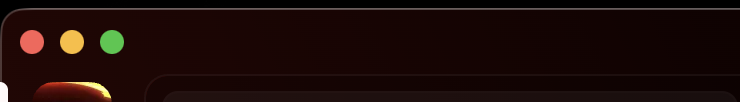

# No Arrows

A simple Vencord/Vesktop theme that disables the back and forward arrows on Discord's desktop app.

## Installation

1. Download the `NoArrows.theme.css` file [from the src folder](src/NoArrows.theme.css).
2. Open Vencord or Vesktop.
3. Go to the Settings menu.
4. Navigate to the Themes section.
5. Click on "Open Themes Folder".
6. Move the downloaded `NoArrows.theme.css` file into the opened folder.
7. Go back to Vencord or Vesktop and enable the "No Arrows" theme.
8. Done! 🎉

## Screenshots

*Before applying the theme:*

*After applying the theme:*

## License

This project is licensed under the MIT License. See the [LICENSE](LICENSE) file for details.
